# Passo a passo na utilização das ferramentas

### Observações

Antes de iniciar os procedimentos, tenha em mente que para evitar problemas descenessários, crie todos os recursos na mesma região.

### Criando Serviços Cognitivos

Para criar os serviços cognitivos é necessário cumprir algumas etapas bem similares às realizadas em laboratórios anteriores. Nenhuma novidade aqui


### Criando AI Search

No recurso de AI Search, todas as etapas são bem similares às anteriores. Porém não esqueça de alterar a camada de preço de Standard para Basic, como na Imagem 2

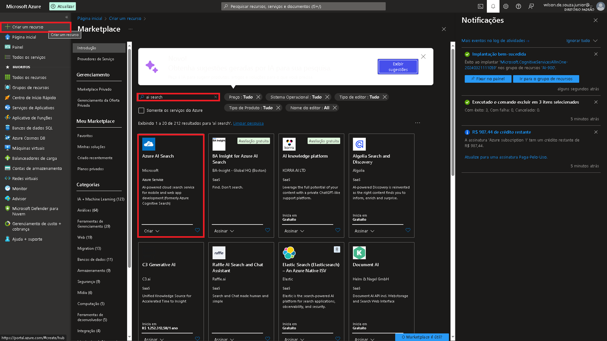
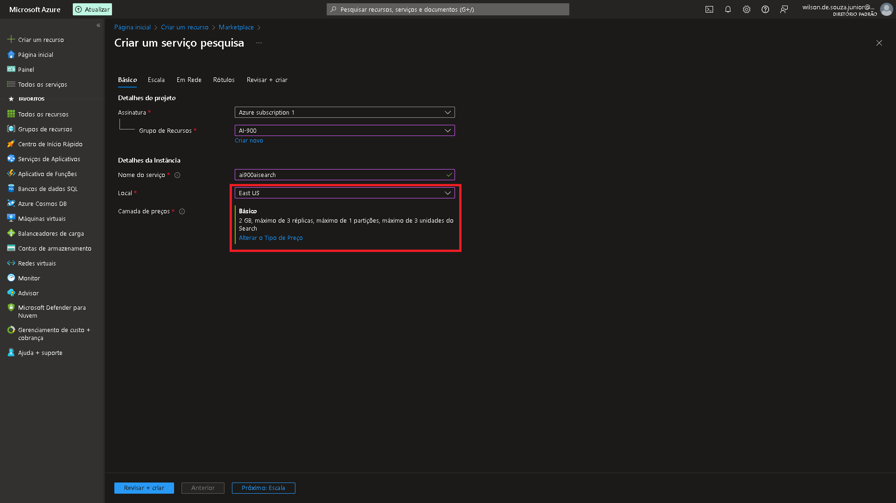

### Criando Armazenamento

Para criar o armazenamento, as primeiras etapas são idênticas às anteriores dos outros serviços, porém atente-se para alterar a redundância para LRS, conforme Imagem 2

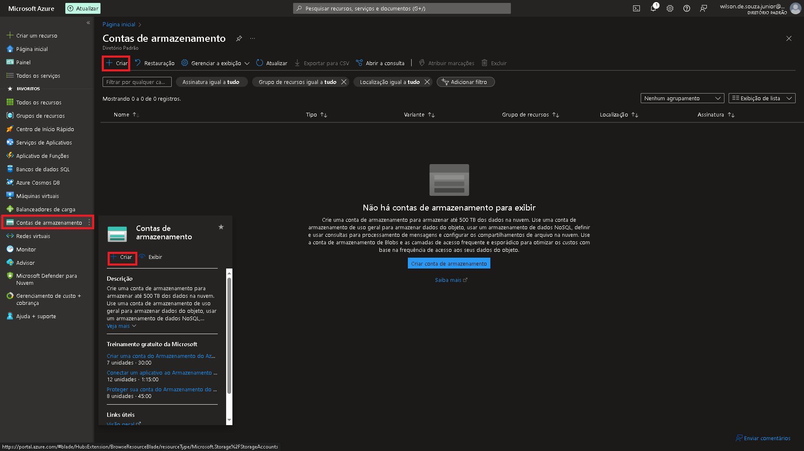
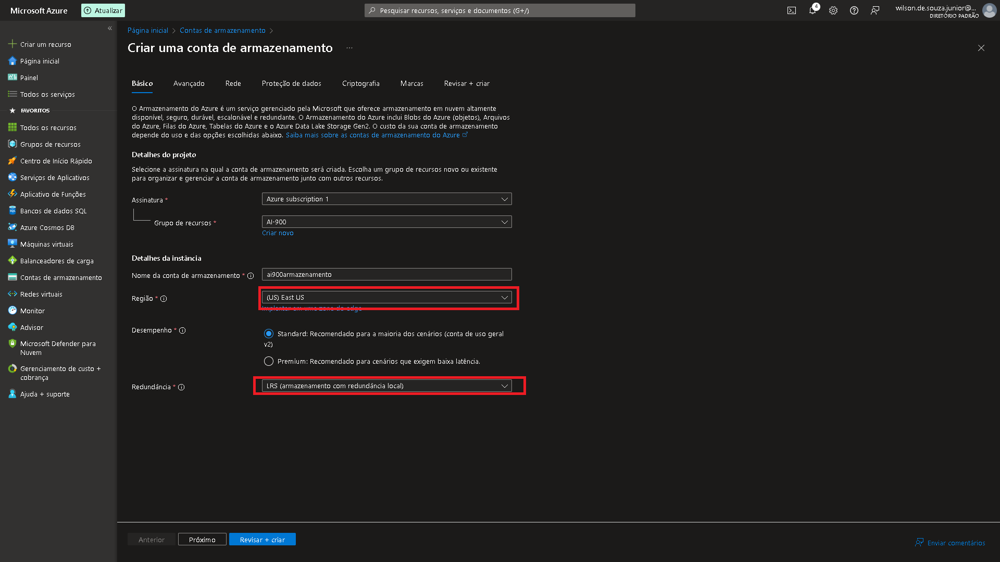

Após criar o recurso de armazenamento, vá até a aba Configuração e habilite o acesso anônimo ao Blob, conforme Imagem 3

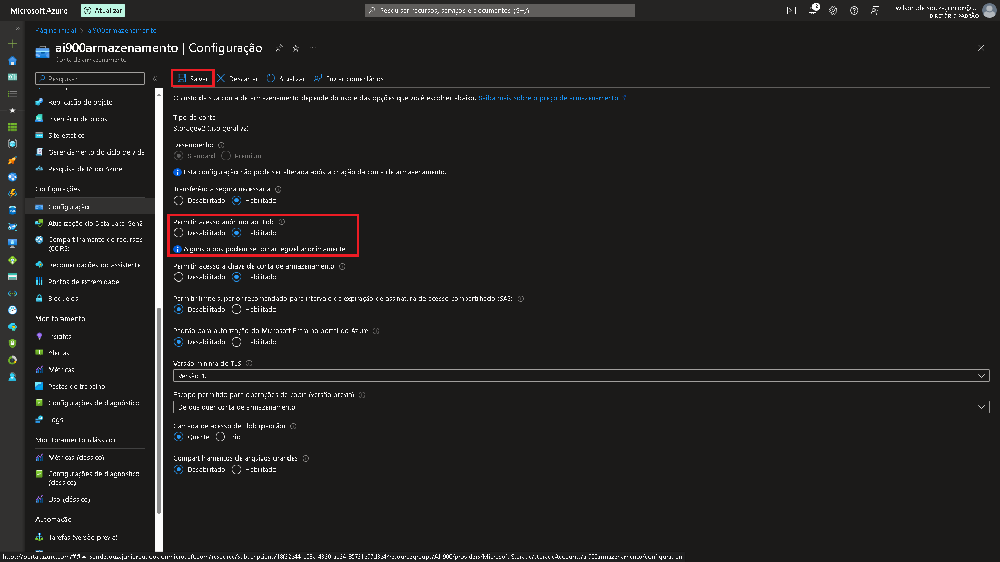

Suba para a aba Contêineres e crie um novo alterando o nível de acesso para "acesso de leitura anônimo para conteineres...", conforme Imagem 4

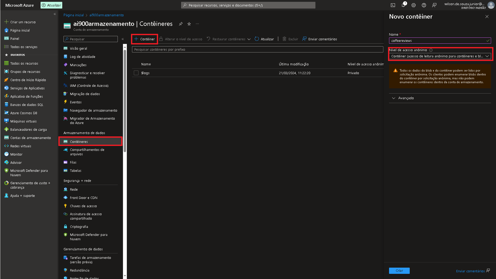

E por fim, volte à Visão Geral, carregue os arquivos baixados [aqui](https://aka.ms/mslearn-coffee-reviews) (podem ser encontrados na [documentação](https://microsoftlearning.github.io/mslearn-ai-fundamentals/Instructions/Labs/11-ai-search.html) do AI Search) elecionando o contêiner recém criado.

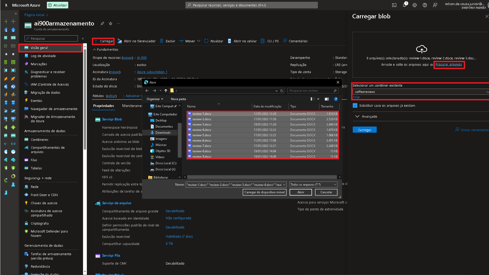

### Consumindo AI Search

Após seguidas todas as etapas, chegamos à etapa final, onde iremos consumir os dados obtidos dos arquivos baixados.

Volte à tela do recurso de IA Search e importe os dados, conforme Imagem 1

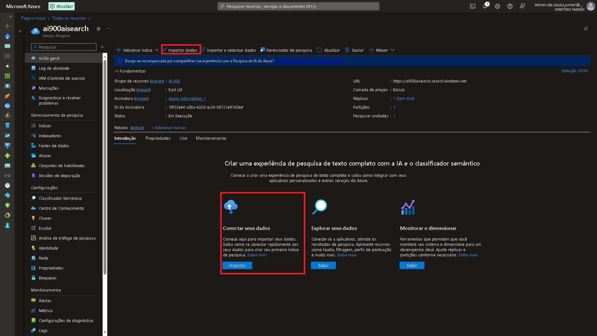

Atenção a seguir, pois a forma encontrada é diferente da usada em vídeo.

Na fonte de dados, altere de "Fonte de dados existentes" para "Armazenamento de Blob da Azure";
Feito isso, em cadeia de conexão, escolha a conexão existente (será o contêiner criado há pouco tempo - busque pelo mesmo nome usado na criação)

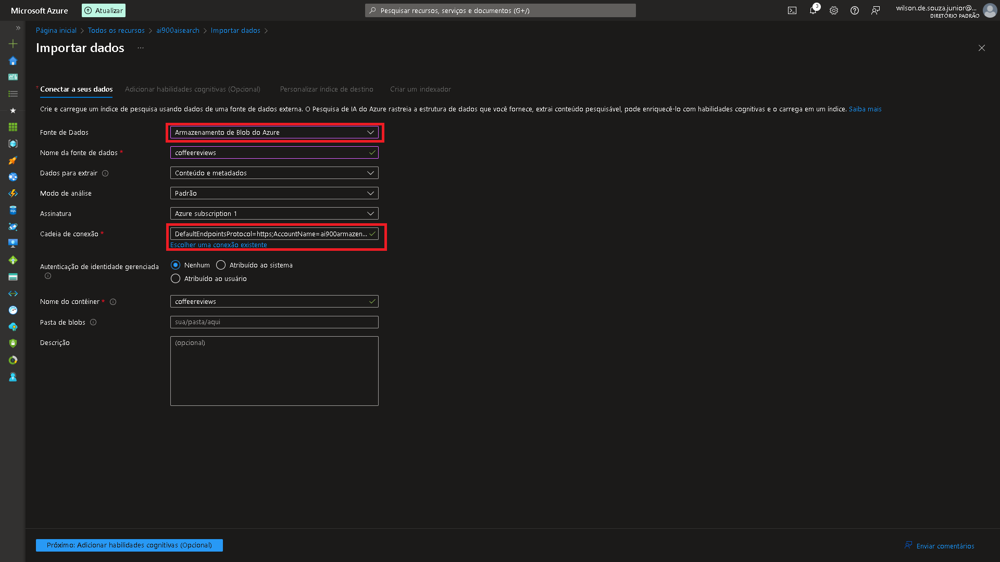

Siga os demais passos de maneira padrão, sem precisar alterar nenhum dado caso queira.

Volte à tela do recurso de IA Search e explore os dados, conforme Imagem 3

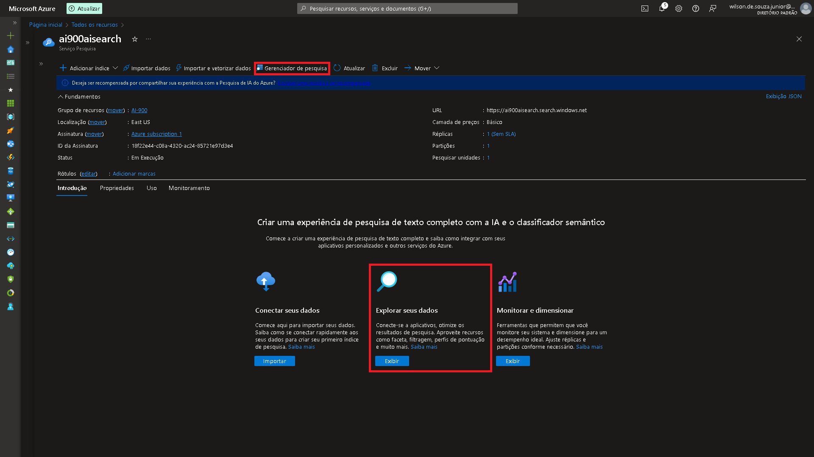

E por fim, entre com os códigos demonstrados em vídeo e conforme Imagem 4, ou copie alguns abaixo:
```search=*&$count=true```	

```search=locations:'Chicago'```	

```search=location:'Chicago'```	

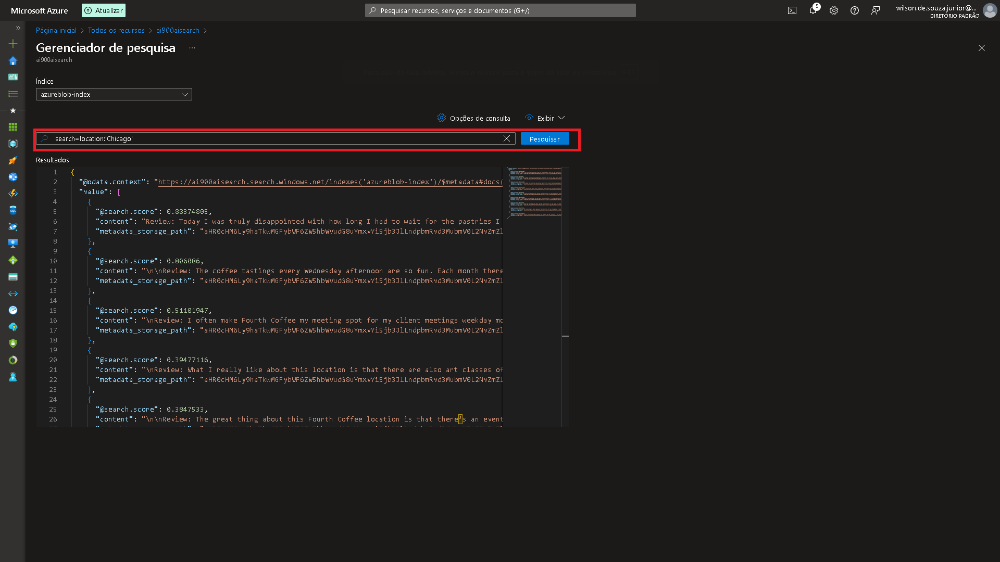