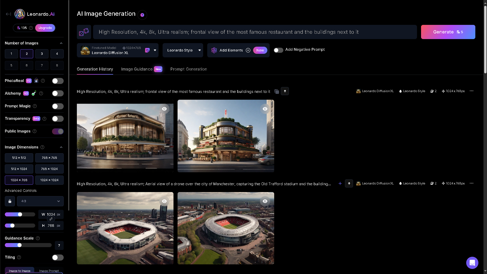
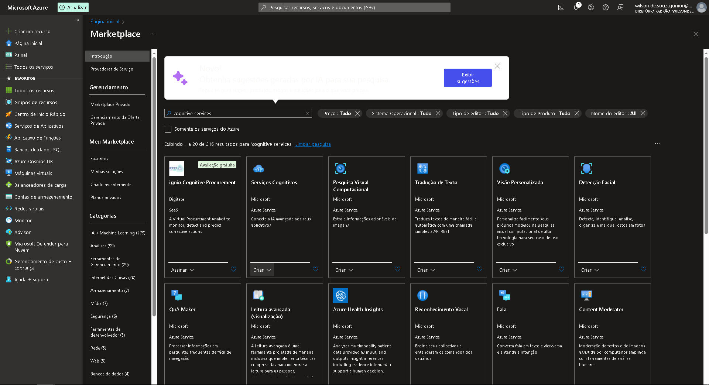
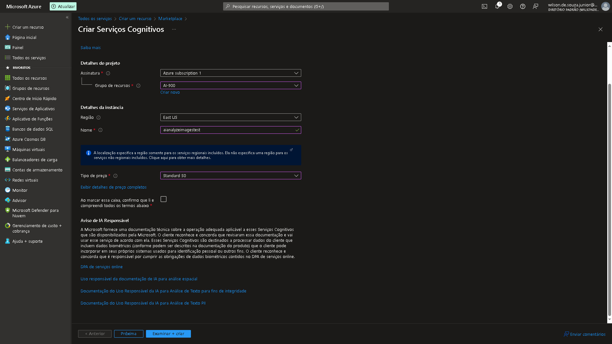
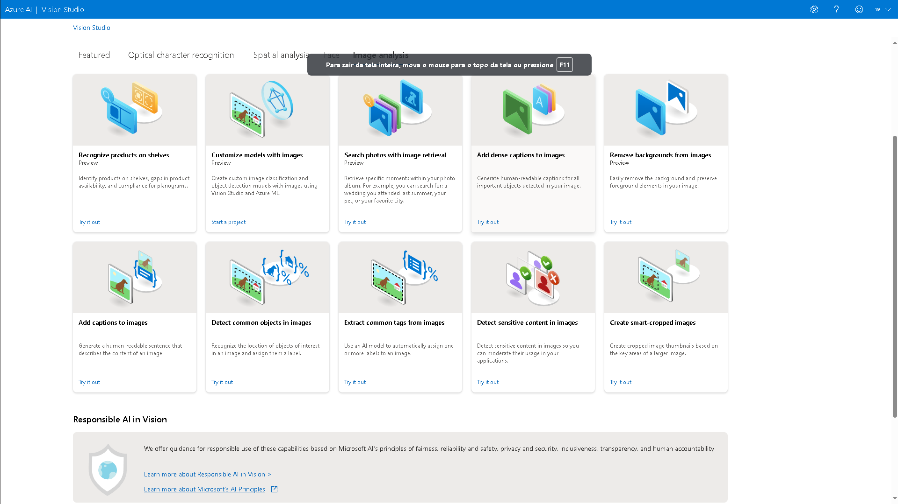
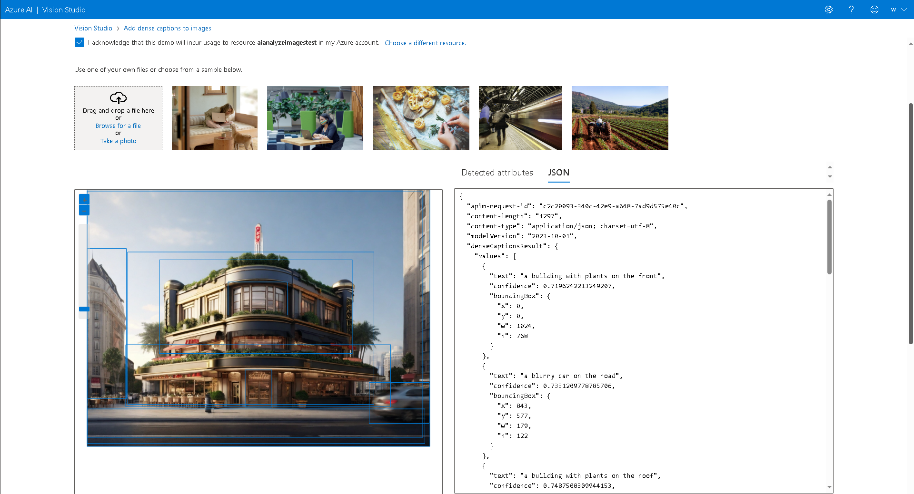

# Passo a passo na utilização de ferramentas utilizadas

## Escolhendo imagens

Foi uilizado a Inteligência Artificial Generativa Leonardo AI para criar as imagens utilizadas no processo.

## Criando o recurso no Azure

Algumas etapas foram necessárias para criação do recurso que disponibilizaria a execução da funcionalidade de análise de imagens.

## Utilizando o serviço "add dense captions to images"

Etapa final de todo o processo, foi feito o upload das imagens criadas anteriormente, e retirado o output das imagens em forma de JSON.

