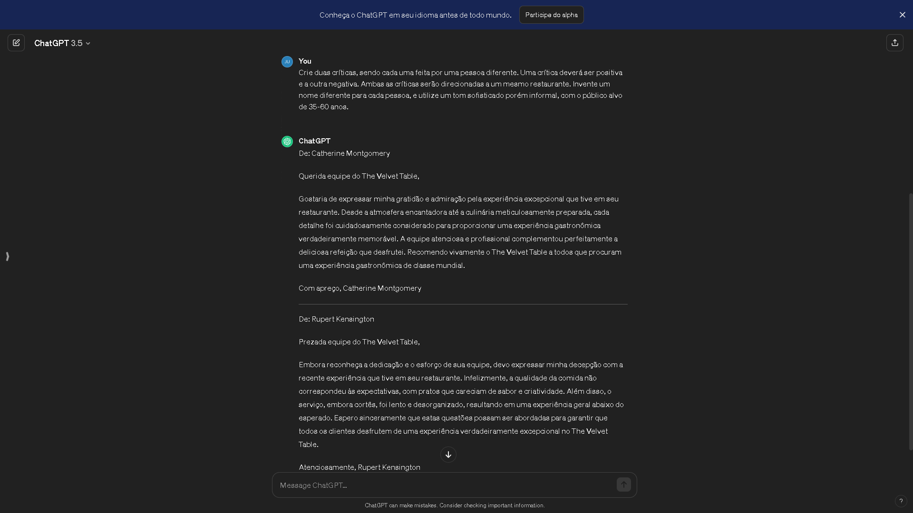
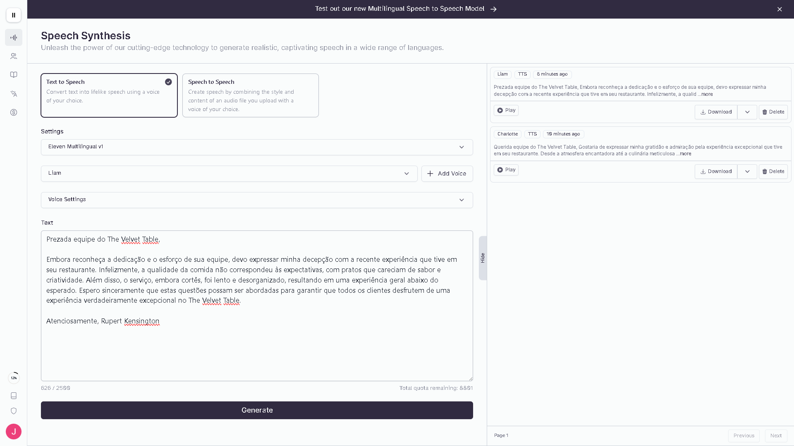
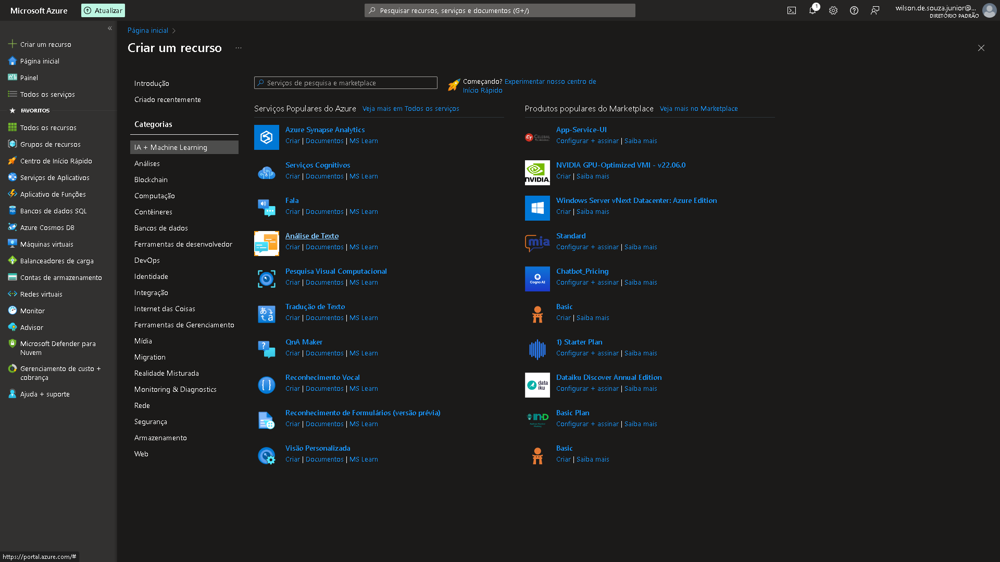
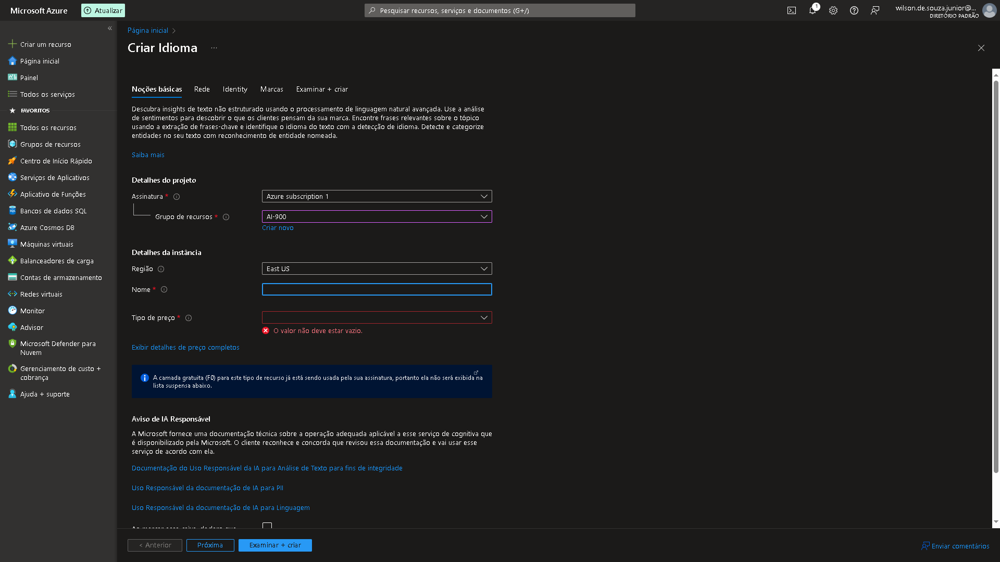
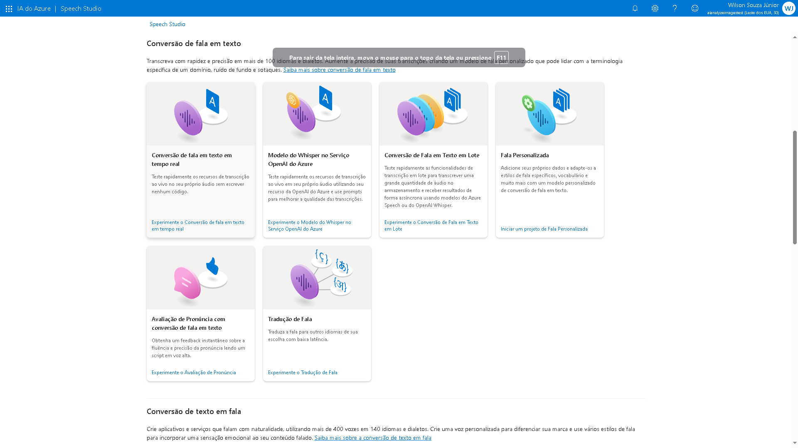
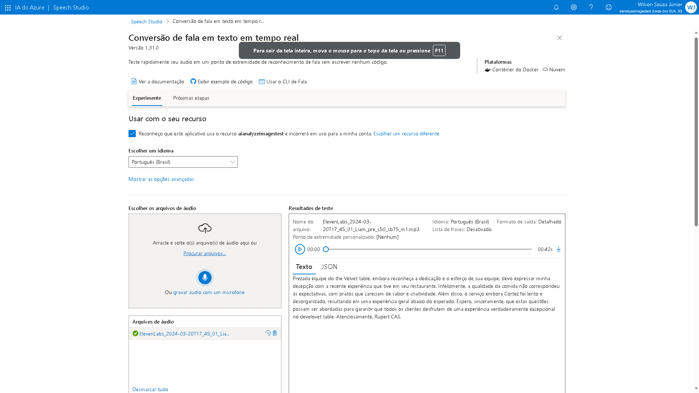
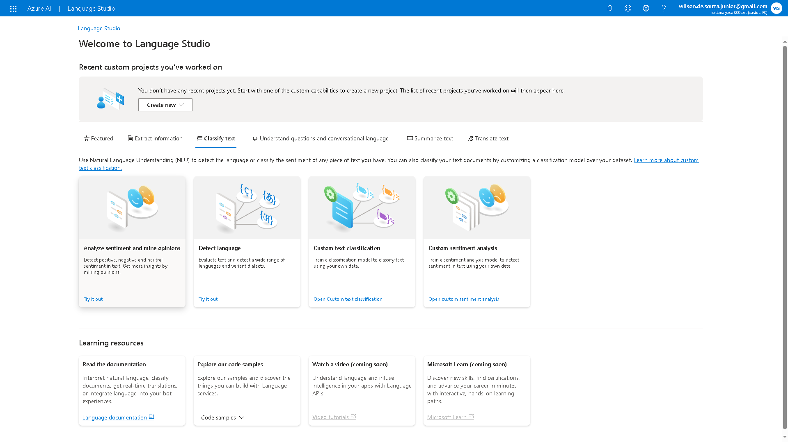
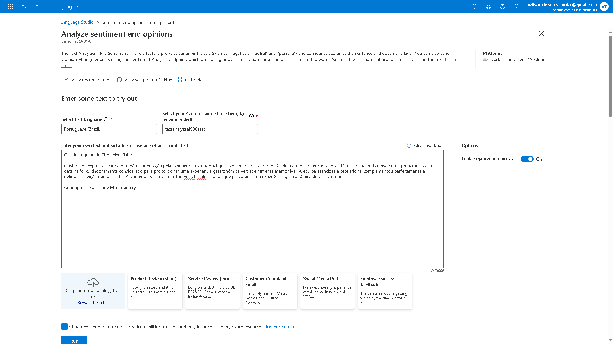
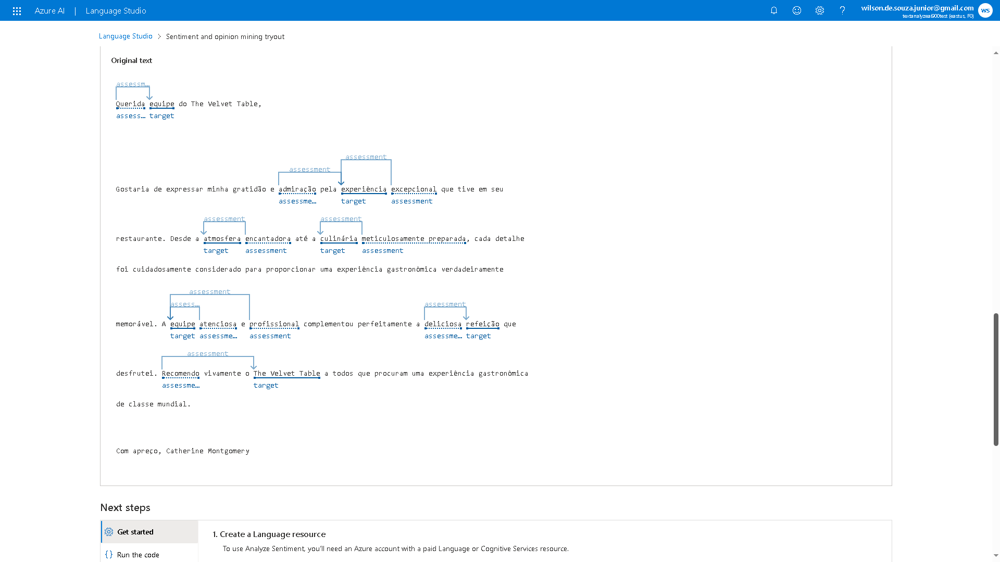

# Passo a passo na utilização das ferramentas

## Gerando Textos e Áudios

Utilizados a Inteligência Artificial Generativa ChatGPT para criar os textos, e a partir de um destes, foi gerado um áudio através da Inteligência Artificial Generativa de Voz Eleven Labs.

## Criando o recurso no Azure

Algumas etapas foram necessárias para criação do recurso que disponibilizaria a execução da funcionalidade de análise de textos.

## Utilizando do serviço "Conversão de fala em texto" e "Analyze sentiment and opinions"

Etapa final de todo o processo, foi feito o upload das textos e áudios criadas anteriormente, e retirado o output destes em forma de JSON.

### Conversão de fala em texto 

### Analyze sentiment and opinions

