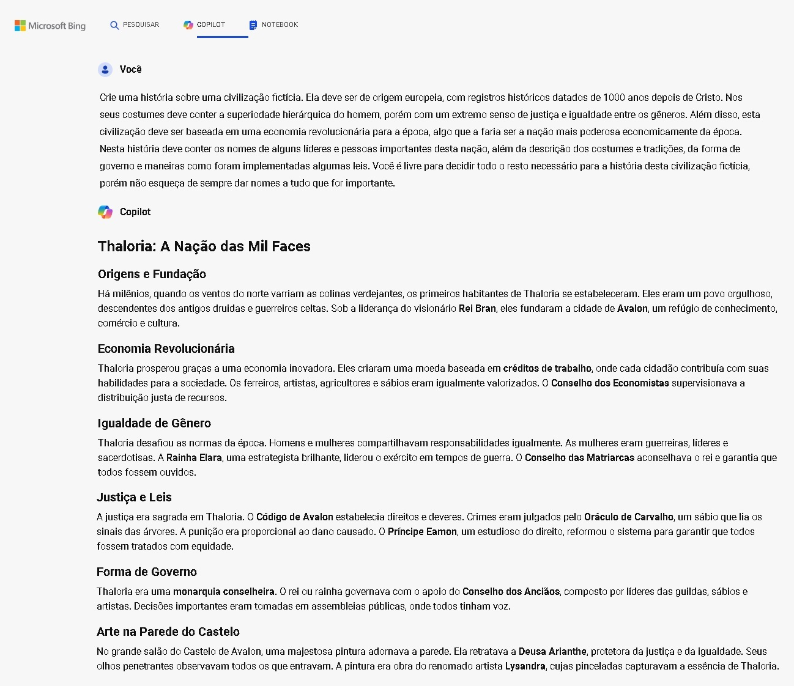
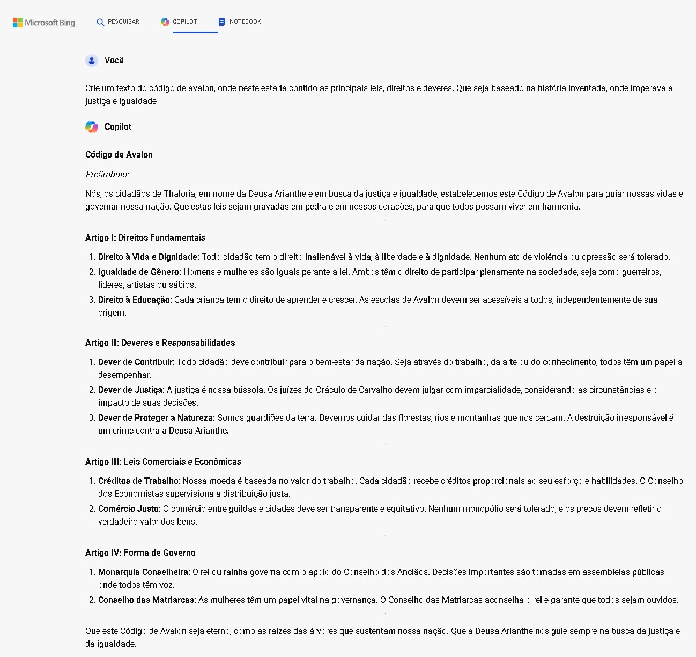
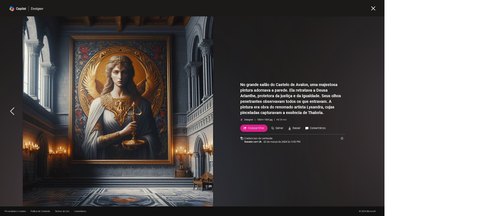
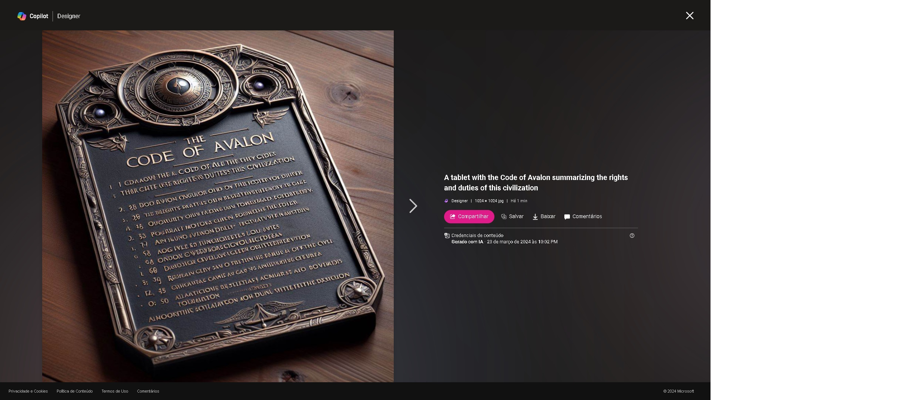
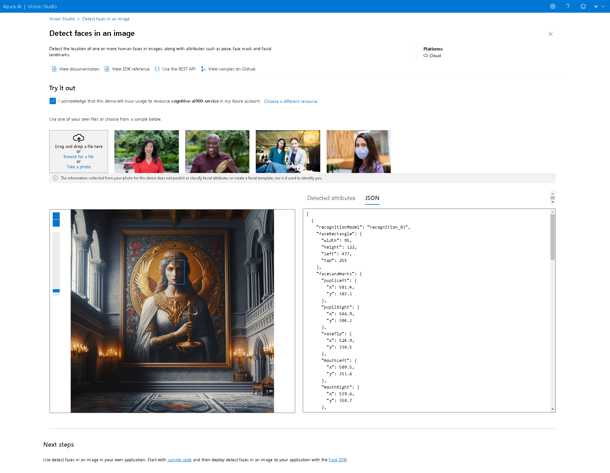
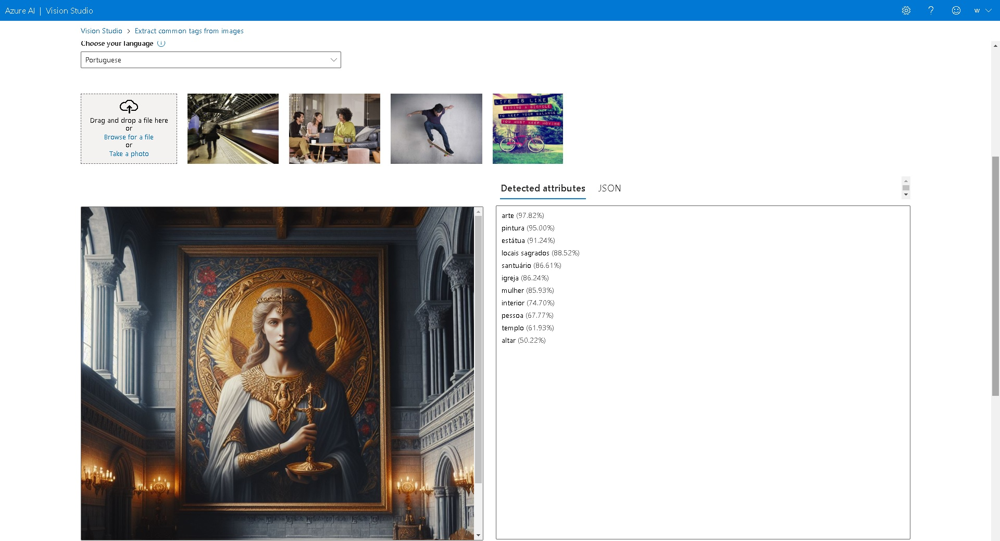
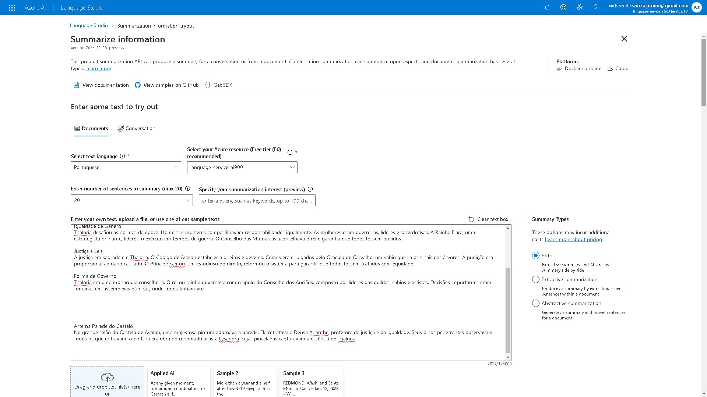
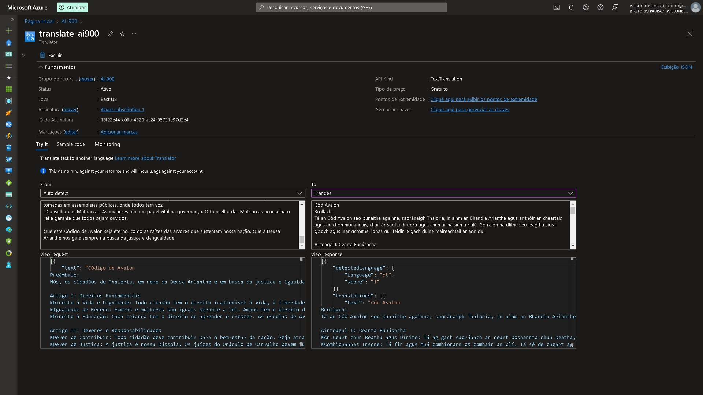

# Utilização das ferramentas

### Observações

Antes de iniciar os procedimentos, tenha em mente que para evitar problemas descenessários, crie todos os recursos na mesma região.
No mais, como foram criados os mesmos recursos utilizados anteiormente, não haverá passo-a-passo da criação dos mesmos. Por isso, terá somente os insigths dos inputs usados e outputs gerados.

### Microsoft Copilot

### Microsoft Designer

### Detect Face Azure

### Tags from Image Azure

### Texts from Image Azure

### Summarize Information Azure

### Translate Azure

